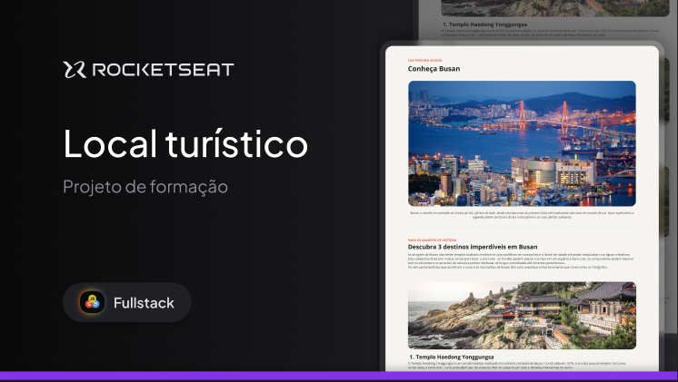
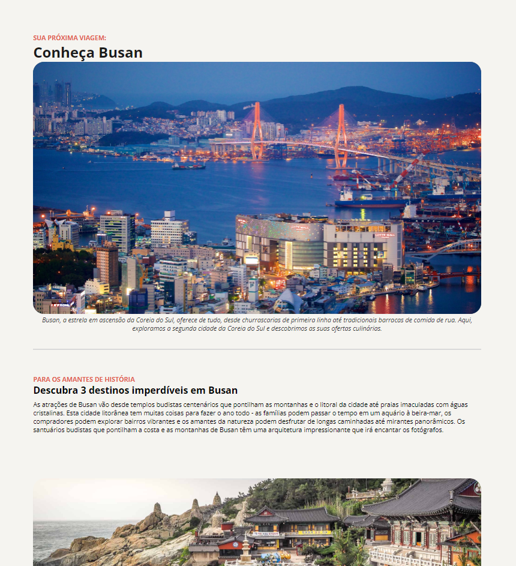

  <h1 align="center">Local Turístico - Rocketseat Fullstack :rocket: </h1>

  

___

## 💻 Sobre
Nesse projeto foi desenvolvido uma página simples de Local Turístico.
Esse é um dos projetos desenvolvidos em aula na formação Full-stack, um de nossos conteúdos de especialização.
___

# 🔨 O que foi feito neste desafio:

 - Estrutura HTML;
 - Uso de fontes;
 - Uso de imagens;
 - Alterações das cores dos textos;
 - Estilizações com CSS;
 - Espaçamentos;
 - Listas desordenadas;
 - Alterações dos pesos dos textos;

## 🎨 Layout

  

___

## 🛠 Tecnologias

As seguintes tecnologias foram empregadas na criação deste projeto:

- HTML
- CSS
- Figma
___
